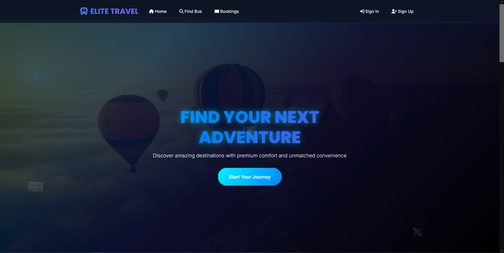
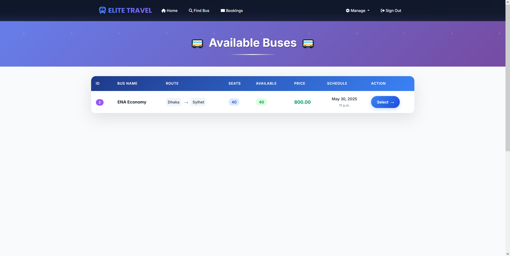
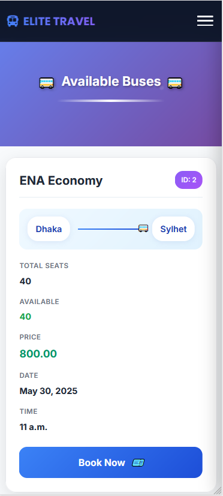
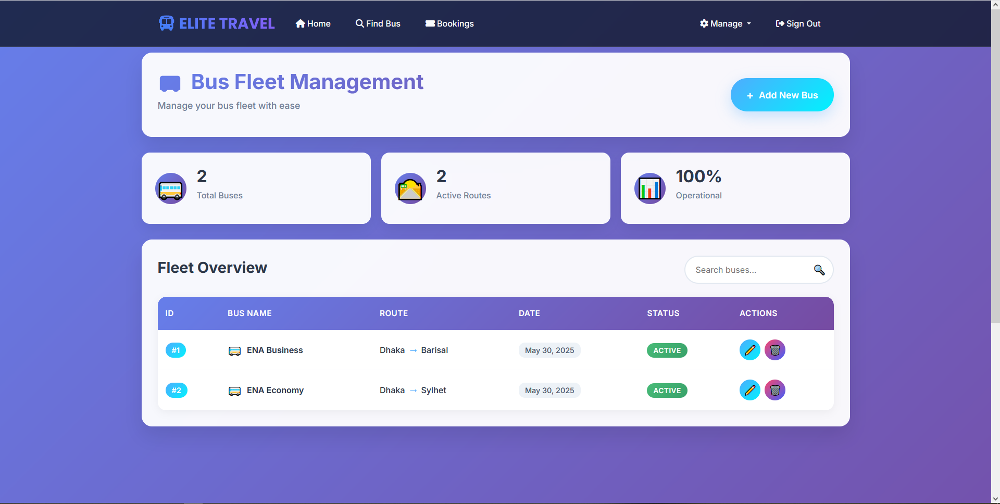
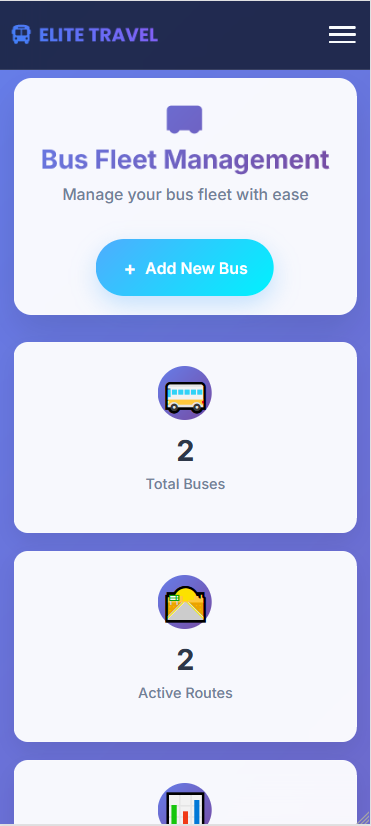

# Bus Management System

A **Bus Management System** built using **Python** and the **Django** web framework. This backend-focused project implements full CRUD functionality with a structured database. The system allows users to book bus tickets, view invoices, check bus availability, and manage bookings, while admins have full control over bus data through the Django admin panel.

## Features

### User Features:

* **Signup / Signin**: New users can register and log in to their accounts.
* **Book Tickets**: Book bus tickets by selecting destination, time, and available seats.
* **Invoice Generation**: View booking details and download invoices.
* **Availability Check**: Check bus availability for specific routes and times.
* **Cancel Booking**: Cancel existing bookings and see status in user dashboard.
* **See Bookings**: View current and past bookings, along with status.

### Admin Features:

* **Admin Panel**: Access Django's built-in admin interface.
* **Manage Section**: Centralized tools for admin-level operations:
  - **Manage Buses**: Add, update, and delete bus details.
  - **Bookings**: View and manage all user bookings.
  - **Booking Details**: Inspect detailed records of each booking.
  - **Blog**: Post travel updates, announcements, and notices.
  - **Gallery**: Upload and manage images related to buses or services.
* **Monitor Bookings**: Track booking statuses and user activity.
* **Custom Booking**: Manually create or cancel bookings as an admin.
* **Seat Auto-Allocation**: Automatically assign seats if none are specified.
* **Monitor Bookings**: View all user bookings and statuses.

## Technologies Used

* **Backend**: Django (Python)
* **Frontend**: HTML5, Tailwind CSS, JavaScript
* **Database**: SQLite (default), easily extendable to PostgreSQL or MySQL
* **Deployment**: Compatible with platforms like PythonAnywhere

## Installation

1. **Clone the repository**

```bash
https://github.com/nazmusweb.coding/bus-management-system.git
```

2. **Navigate to the project directory**

```bash
cd Bus-Management-System/myproject
```

3. **Create a virtual environment**

```bash
python -m venv env
source env/bin/activate  # On Windows use `env\Scripts\activate`
```

4. **Install dependencies**

```bash
pip install -r requirements.txt
```

5. **Apply migrations**

```bash
python manage.py migrate
```

6. **Create a superuser**

```bash
python manage.py createsuperuser
```

7. **Run the development server**

```bash
python manage.py runserver
```

8. **Access the application**

* User Interface: `http://127.0.0.1:8000/`
* Admin Panel: `http://127.0.0.1:8000/admin/`
* Live Host (until Saturday, 16 August 2025): `https://nazmusweb.pythonanywhere.com/`

## Screenshots

### Homepage

| Desktop View                              | Mobile View                               |
|-------------------------------------------|-------------------------------------------|
|        |       |
|https://github.com/user-attachments/assets/f237dce0-bb3d-4ca4-9083-4c1668fd030f|

### Available Buses

| Desktop View                                  | Mobile View                                   |
|-----------------------------------------------|-----------------------------------------------|
|          |           |

### Admin - Manage Buses

| Desktop View                                     | Mobile View                                      |
|--------------------------------------------------|--------------------------------------------------|
|             |              |


## Contributing

Pull requests are welcome. For major changes, please open an issue first to discuss what you would like to change.

## License

This project is licensed under the MIT License.
